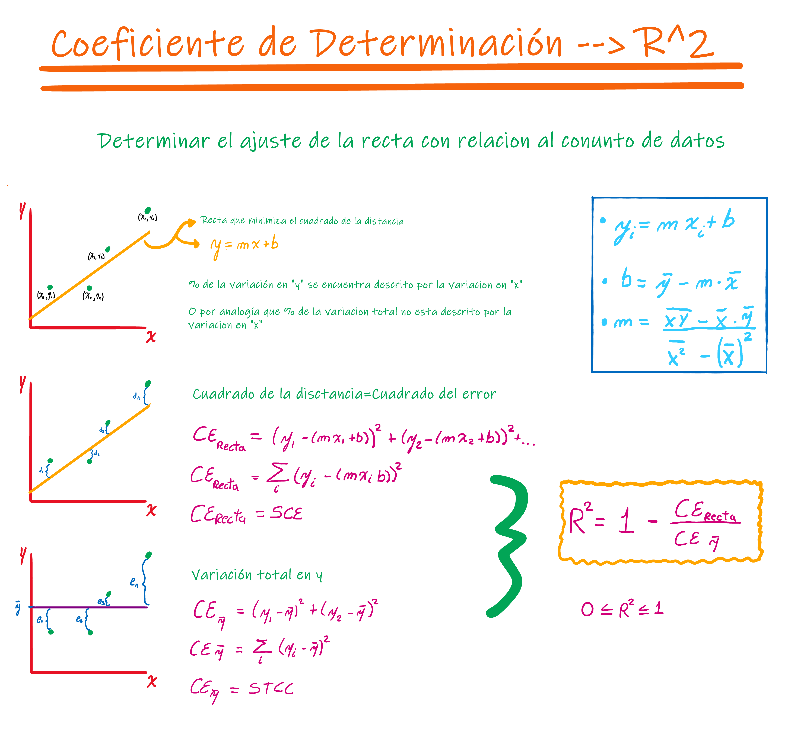
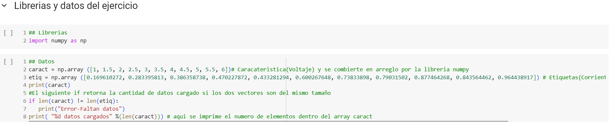
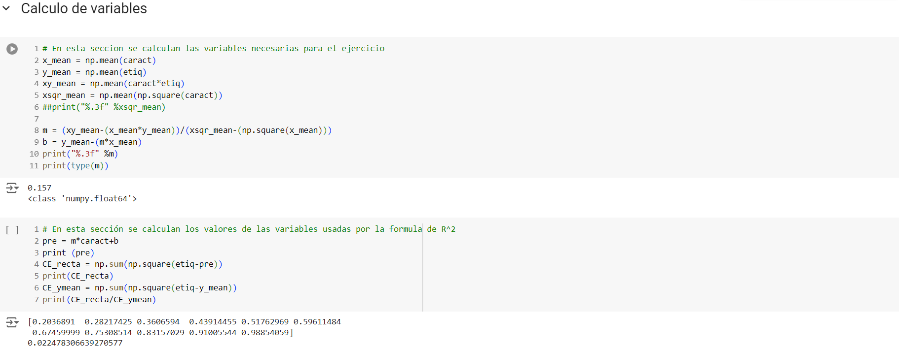
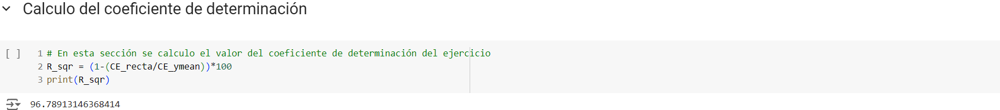

# Coeficiente de Determinación
Aquí se encuentra el código para calcular R^2, así como las fórmulas usadas.  
__Video Explicativo YOUTUBE__

    

    <b>
        <a 
        href="https://www.youtube.com/watch?v=MUJbQ6qhvHw"> Video Coeficiente de Determinación
        </a>
    </b>

## Funciones y Ecuaciones

  

## Python
### Librerias

  

### Variables

  

### Resultado

  

