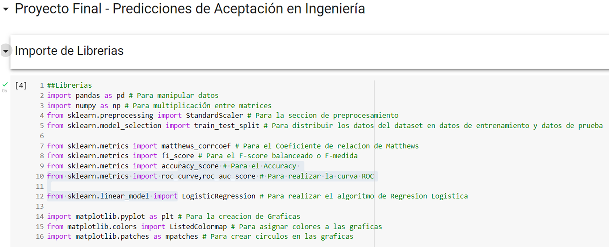
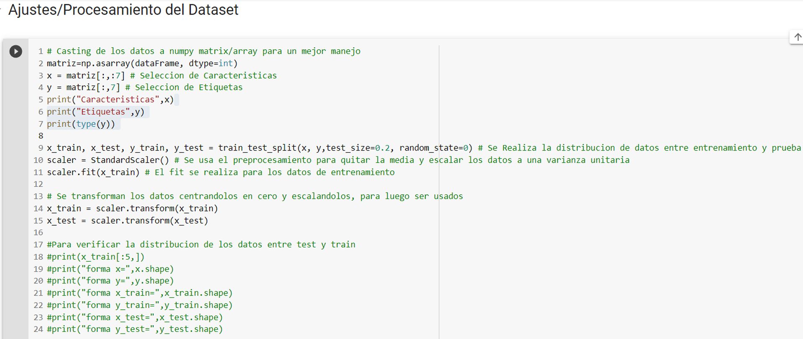
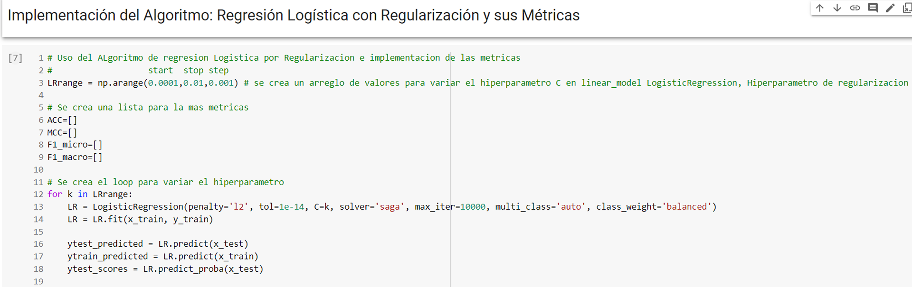
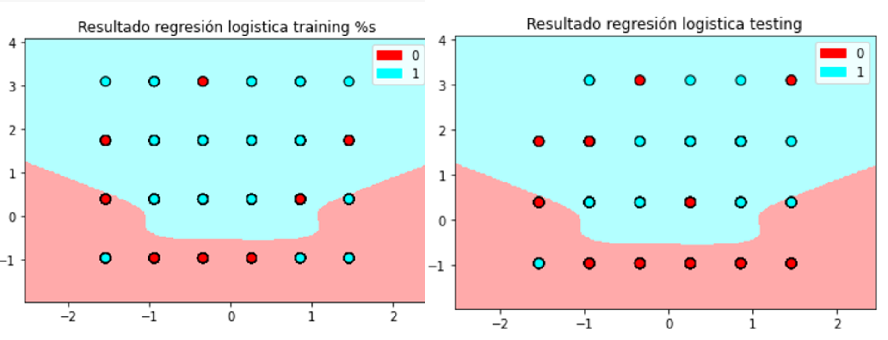

# Proyecto Final
Este proyecto está orientado hacia la implementación de __algoritmos de aprendizaje de máquina__ para proponer una solución a un dataset en particular.

La base de datos escogida para el desarrollo de este proyecto es __Predicciones de Aceptación en Ingeniería (***Engineering Placements Prediction***)__, la cual está basada en datos proporcionados por una universidad anónima entre los años 2013 y 2014.

Ahora, usando algoritmos de aprendizaje de máquina se determina si un estudiante es aceptado o no en su carrera escogida teniendo en cuenta las características proporcionadas.

Partiendo de la premisa anterior el algoritmo a ser implementado es uno de __clasificación y supervisado__, es decir, se tienen las características y la etiqueta del data set. El algoritmo usado en este proyecto es el de __regresión logística__.

La información fue estructurada siguiendo el modelo __CRISP-DM__, del cual se plantean las fases de: __Business Understanding, Data Understanding, Data Preparation, Modeling y Evaluation, la última fase de despliegue no es tenida en cuenta.__

__[Video explicando el proyecto](https://youtu.be/gMlwIeQes6g)__

## Snippets de Python del codigo y el algoritmo usado
### Declaración Librerias

  

### Ajustes al dataset

  

### Algoritmo

  

## Resultados

### Mejor iteración/Resultado de las métricas.

  

### Mapa de color con datos de entrenamiento y con datos de prueba.

  

# Referencias
* [Sklearn.linear_model.LogisticRegression. (2007). Scikit-Learn. Recuperado 2021](https://scikit-learn.org/stable/modules/generated/sklearn.linear_model.LogisticRegression.html)
* [Overview — NumPy v1.21 Manual. (2021). numpy.org. Recuperado 2021](https://numpy.org/doc/stable/index.html)
