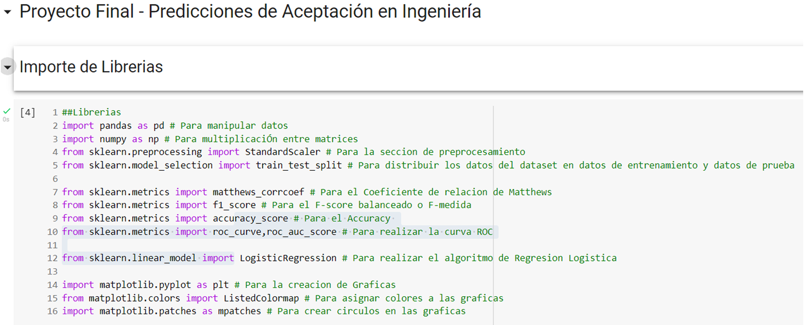

# Inteligencia-Artificial

Los proyectos de Inteligencia artificial realizados están orientados hacia la implementación de algoritmos de aprendizaje de máquina para proponer una solución a un dataset en particular.  

El lenguaje de programación utilizado es __Python__ asi como también las librerias: __numpy, pandas, matplotlib,  sklearn.__

## Snippets de Python y sus resultados

### Declaración de librerias 

  

### Resultados con datos de entrenamiento y de prueba

  

